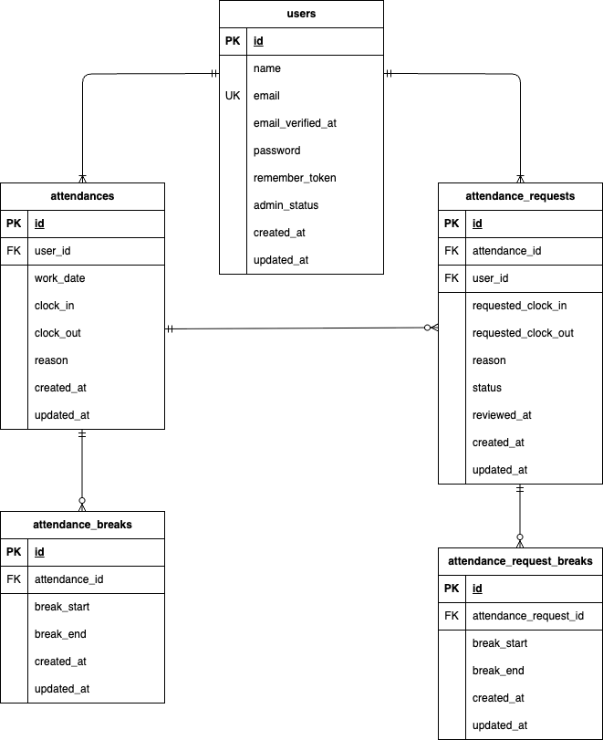

# kintai_app（新模擬案件\_勤怠管理アプリ）

## アプリ概要

勤怠管理アプリです。

### 主な機能

- 会員登録
- ログイン
- メール認証
- 出勤・退勤・休憩
- 勤怠一覧
- 勤怠修正申請
- 管理者承認
- スタッフ一覧
- 勤怠レポート
- 公開API

## 使用技術（実行環境）

- PHP 8.1
- Laravel 8.83.29
- MySQL 8.0
- Nginx
- Docker
- Docker Compose

## ER図



## 環境構築

1. `git clone git@github.com:yuyu580905-dev/kintai_app.git`
2. DockerDesktopアプリを立ち上げる
3. `cd kintai_app/`
4. `make init`

## メール認証について

本アプリではメール認証にMailtrapを使用しています

### Mailtrap設定

1. [Mailtrap](https://mailtrap.io/) に登録
2. Sandbox を作成
3. Sandbox の Integration から「laravel 7.x and 8.x」を選択し、<br>
   .envファイルのMAIL_MAILERからMAIL_ENCRYPTIONまでの項目をコピー＆ペーストしてください。

設定後、以下を実行してください

```bash
php artisan config:clear
```

## テストアカウント

シーディング実行後、以下のユーザーでログインできます。

| 種別          | メールアドレス    | パスワード |
| ------------- | ----------------- | ---------- |
| 一般ユーザー1 | user1@example.com | password   |
| 一般ユーザー2 | user2@example.com | password   |
| 管理者        | user3@example.com | password   |

※管理者ユーザーは `admin_status = true` が設定されています。<br>
※すべてメール認証済みです。

## API

本アプリでは公開APIも実装しています。

### エンドポイント

| Method | URL                             | 概要         |
| ------ | ------------------------------- | ------------ |
| GET    | /api/v1/attendance-records      | 勤怠一覧取得 |
| GET    | /api/v1/attendance-records/{id} | 勤怠詳細取得 |
| POST   | /api/v1/attendance-records      | 勤怠登録     |
| PUT    | /api/v1/attendance-records/{id} | 勤怠更新     |
| DELETE | /api/v1/attendance-records/{id} | 勤怠削除     |

※ {id} は勤怠レコードのIDを表します。

### 認証

- GETは認証不要
- POST / PUT / DELETE は Laravel Sanctum による認証が必要

## テスト

PHPUnitを使用して以下の機能テストを実装しています

#### 一般ユーザー

- 会員登録認証機能
- メール認証機能
- ログイン認証機能
- 日時取得機能
- ステータス確認機能
- 出勤機能
- 休憩機能
- 退勤機能
- 勤怠一覧情報取得機能
- 勤怠詳細情報取得機能
- 勤怠詳細情報修正機能
- マイ勤怠レポート機能

#### 管理者

- ログイン認証機能
- 勤怠一覧情報取得機能
- 勤怠詳細情報取得・修正機能
- ユーザー情報取得機能
- 勤怠情報承認機能

#### 公開API

- 公開API 読み取り系
- 公開API 書き込み系
- Sanctum 認証

## PHPUnit テスト実行

本アプリではテスト実行時に `demo_test` データベースを使用します

### 1. テスト用データベース作成

MySQLコンテナへ接続し、テスト用データベースを作成

```sql
CREATE DATABASE demo_test;
```

### 2. .env.testing を作成

PHPコンテナへ接続し、`.env` をコピーして `.env.testing` を作成

```bash
cp .env .env.testing
```

.env.testingを以下の内容へ変更

```env
APP_NAME=Laravel
APP_ENV=test
APP_KEY=
APP_DEBUG=true
APP_URL=http://localhost

DB_CONNECTION=mysql_test
DB_HOST=mysql
DB_PORT=3306
DB_DATABASE=demo_test
DB_USERNAME=root
DB_PASSWORD=root
```

### 3. テスト用アプリケーションキー生成

```bash
php artisan key:generate --env=testing
```

### 4. キャッシュの削除

```bash
php artisan config:clear
```

### 5. マイグレーションを実行してテスト用のテーブルを作成

```bash
php artisan migrate --env=testing
```

### 6. PHPUnit実行

```bash
php artisan test
```

## URL

- 開発環境：http://localhost/
- phpMyAdmin：http://localhost:8080/
